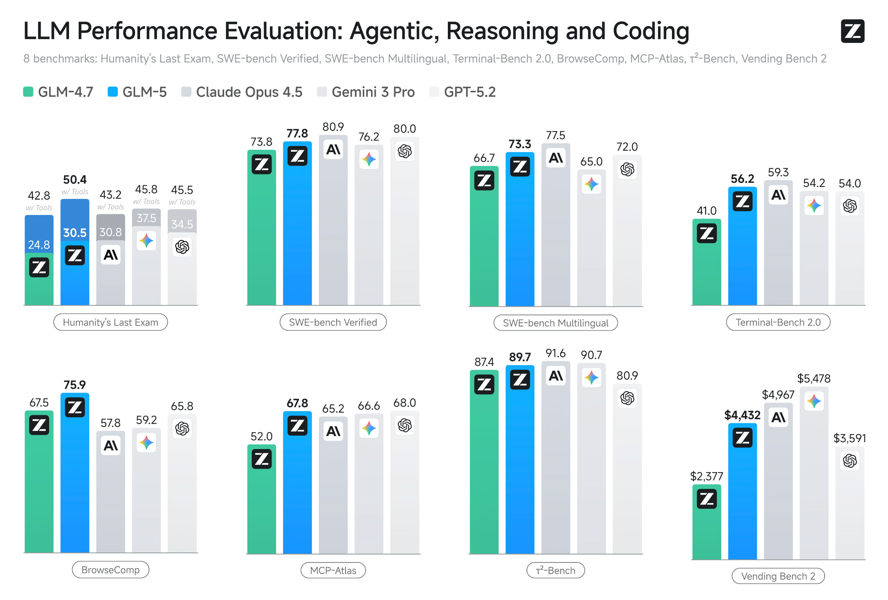

# GLM-5

<div align="center">

</div>
<p align="center">
    👋 Join our <a href="https://discord.gg/QR7SARHRxK" target="_blank">Discord</a> community.
    <br>
    📖 Check out the GLM-5 <a href="https://z.ai/blog/glm-5" target="_blank">technical blog</a>.
    <br>
    📍 Use GLM-5 API services on <a href="https://docs.z.ai/guides/llm/glm-5">Z.ai API Platform. </a>
    <br>
    👉 One click to <a href="https://chat.z.ai">GLM-5</a>.
</p>

## Introduction




## Download Model

| Model     | Download Links                                                                                                                  | Model Size | Precision |
|-----------|---------------------------------------------------------------------------------------------------------------------------------|------------|-----------|
| GLM-5     | [🤗 Hugging Face](https://huggingface.co/zai-org/GLM-5)<br> [🤖 ModelScope](https://modelscope.cn/models/ZhipuAI/GLM-5)         | 744B-A40B  | BF16      |
| GLM-5-FP8 | [🤗 Hugging Face](https://huggingface.co/zai-org/GLM-5-FP8)<br> [🤖 ModelScope](https://modelscope.cn/models/ZhipuAI/GLM-5-FP8) | 744B-A40B  | FP8       |

## Serve GLM-5 Locally

For local deployment, GLM-5 supports inference frameworks including vLLM and SGLang. Comprehensive deployment
instructions are available in the official [Github](https://github.com/zai-org/GLM-5) repository.

vLLM and SGLang only support GLM-5 on their main branches. you can use their official docker images for inference.

### Prepare environment

+ vLLM

Using Docker as:

```shell
docker pull vllm/vllm-openai:nightly 
```

or using pip:

```shell
pip install -U vllm --pre --index-url https://pypi.org/simple --extra-index-url https://wheels.vllm.ai/nightly
```

If you not using with dockr, you’ll need to upgrade transformers. Please follow the commands below:

```
pip install git+https://github.com/huggingface/transformers.git
```

+ SGLang

Using Docker as:

```bash
docker pull lmsysorg/sglang:glm5-hopper # For Hopper GPU
docker pull lmsysorg/sglang:glm5-blackwell # For Blackwell GPU
```

+ xLLM (Ascend NPU)

Using Docker as:

```bash
# A2 x86
docker pull quay.io/jd_xllm/xllm-ai:xllm-dev-hb-rc2-x86
# A2 arm
docker pull quay.io/jd_xllm/xllm-ai:xllm-dev-hb-rc2-arm
# A3 arm
docker pull quay.io/jd_xllm/xllm-ai:xllm-dev-hc-rc2-arm
```

### Deploy

+ vLLM

```shell
vllm serve zai-org/GLM-5-FP8 \
     --tensor-parallel-size 8 \
     --gpu-memory-utilization 0.85 \
     --speculative-config.method mtp \
     --speculative-config.num_speculative_tokens 1 \
     --tool-call-parser glm47 \
     --reasoning-parser glm45 \
     --enable-auto-tool-choice \
     --served-model-name glm-5-fp8
```

+ SGLang

```shell
python3 -m sglang.launch_server \
  --model-path zai-org/GLM-5-FP8 \
  --tp-size 8 \
  --tool-call-parser glm47  \
  --reasoning-parser glm45 \
  --speculative-algorithm EAGLE \
  --speculative-num-steps 3 \
  --speculative-eagle-topk 1 \
  --speculative-num-draft-tokens 4 \
  --mem-fraction-static 0.85 \
  --served-model-name glm-5-fp8 \
```

### Parameter Instructions

+ For agentic tasks of GLM-5, please turn
  on [Preserved Thinking mode](https://docs.z.ai/guides/capabilities/thinking-mode) by adding the following config (only
  sglang support):

  ```
    "chat_template_kwargs": {
        "enable_thinking": true,
        "clear_thinking": false
    }
    ```

+ When using `vLLM` and `SGLang`, thinking mode is enabled by default when sending requests. If you want to disable the
  thinking switch, you need to add the `"chat_template_kwargs": {"enable_thinking": False}` parameter.
+ Both support tool calling. Please use OpenAI-style tool description format for calls.

## Citation

If you find our work useful in your research, please consider citing the following paper:

```bibtex
@misc{5team2025glm45agenticreasoningcoding,
      title={GLM-4.5: Agentic, Reasoning, and Coding (ARC) Foundation Models}, 
      author={GLM Team and Aohan Zeng and Xin Lv and Qinkai Zheng and Zhenyu Hou and Bin Chen and Chengxing Xie and Cunxiang Wang and Da Yin and Hao Zeng and Jiajie Zhang and Kedong Wang and Lucen Zhong and Mingdao Liu and Rui Lu and Shulin Cao and Xiaohan Zhang and Xuancheng Huang and Yao Wei and Yean Cheng and Yifan An and Yilin Niu and Yuanhao Wen and Yushi Bai and Zhengxiao Du and Zihan Wang and Zilin Zhu and Bohan Zhang and Bosi Wen and Bowen Wu and Bowen Xu and Can Huang and Casey Zhao and Changpeng Cai and Chao Yu and Chen Li and Chendi Ge and Chenghua Huang and Chenhui Zhang and Chenxi Xu and Chenzheng Zhu and Chuang Li and Congfeng Yin and Daoyan Lin and Dayong Yang and Dazhi Jiang and Ding Ai and Erle Zhu and Fei Wang and Gengzheng Pan and Guo Wang and Hailong Sun and Haitao Li and Haiyang Li and Haiyi Hu and Hanyu Zhang and Hao Peng and Hao Tai and Haoke Zhang and Haoran Wang and Haoyu Yang and He Liu and He Zhao and Hongwei Liu and Hongxi Yan and Huan Liu and Huilong Chen and Ji Li and Jiajing Zhao and Jiamin Ren and Jian Jiao and Jiani Zhao and Jianyang Yan and Jiaqi Wang and Jiayi Gui and Jiayue Zhao and Jie Liu and Jijie Li and Jing Li and Jing Lu and Jingsen Wang and Jingwei Yuan and Jingxuan Li and Jingzhao Du and Jinhua Du and Jinxin Liu and Junkai Zhi and Junli Gao and Ke Wang and Lekang Yang and Liang Xu and Lin Fan and Lindong Wu and Lintao Ding and Lu Wang and Man Zhang and Minghao Li and Minghuan Xu and Mingming Zhao and Mingshu Zhai and Pengfan Du and Qian Dong and Shangde Lei and Shangqing Tu and Shangtong Yang and Shaoyou Lu and Shijie Li and Shuang Li and Shuang-Li and Shuxun Yang and Sibo Yi and Tianshu Yu and Wei Tian and Weihan Wang and Wenbo Yu and Weng Lam Tam and Wenjie Liang and Wentao Liu and Xiao Wang and Xiaohan Jia and Xiaotao Gu and Xiaoying Ling and Xin Wang and Xing Fan and Xingru Pan and Xinyuan Zhang and Xinze Zhang and Xiuqing Fu and Xunkai Zhang and Yabo Xu and Yandong Wu and Yida Lu and Yidong Wang and Yilin Zhou and Yiming Pan and Ying Zhang and Yingli Wang and Yingru Li and Yinpei Su and Yipeng Geng and Yitong Zhu and Yongkun Yang and Yuhang Li and Yuhao Wu and Yujiang Li and Yunan Liu and Yunqing Wang and Yuntao Li and Yuxuan Zhang and Zezhen Liu and Zhen Yang and Zhengda Zhou and Zhongpei Qiao and Zhuoer Feng and Zhuorui Liu and Zichen Zhang and Zihan Wang and Zijun Yao and Zikang Wang and Ziqiang Liu and Ziwei Chai and Zixuan Li and Zuodong Zhao and Wenguang Chen and Jidong Zhai and Bin Xu and Minlie Huang and Hongning Wang and Juanzi Li and Yuxiao Dong and Jie Tang},
      year={2025},
      eprint={2508.06471},
      archivePrefix={arXiv},
      primaryClass={cs.CL},
      url={https://arxiv.org/abs/2508.06471}, 
}
